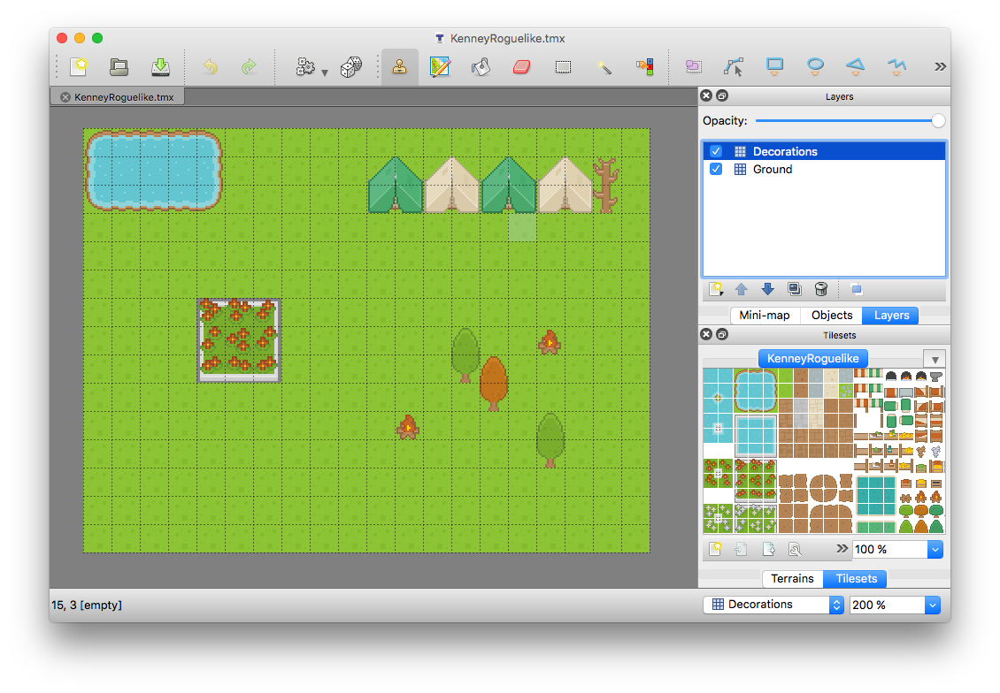
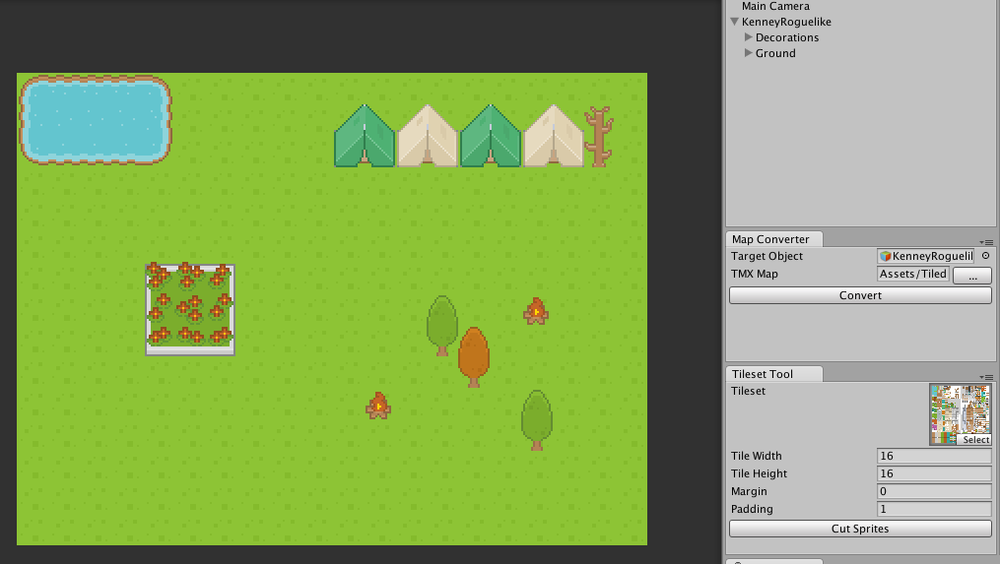
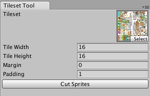
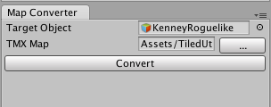

# TiledUtilities

A set of utilities for working with [Tiled](http://mapeditor.org) maps in Unity.

*Note: This is very much a WIP. Lots of things are yet to be implemented.*

The goal of this is to be an editor tool (no runtime scripts) that can import a Tiled TMX map and produce a usable game scene. The tool converts maps from Tiled:

Into objects in Unity:

## Tileset Tool

Open with `Window->Tiled->Tileset Tool`.

The purpose of this tool is to automatically set a texture to use multiple sprites and provide a faster way to cut up the texture into the necessary tiles in a way that is compatible with the map converter.

## Map Converter

Open with `Window->Tiled->Map Converter`.

This is the main editor window. Provide a game object to be the root of the map or leave it blank to have one generated (note: all children are deleted!). Locate the TMX file in your asset directory and click the Convert button. All layers are represented as Z-ordered objects in the map root and each tile is added as a new Sprite.

# Credits/License

As with all UnityCommunity scripts, TiledUtilities code is provided under the terms of the MIT License.

TiledUtilities is built on [TiledSharp](https://github.com/marshallward/TiledSharp) which is licensed under the Apache 2.0 License. TiledSharp uses [DotNetZip](https://dotnetzip.codeplex.com) which is licensed under the Ms-PL License. The exact licenses were taken from TileSharp and can be found in the `Editor/TiledSharp` directory in this repo.

Example artwork created by [Kenney](http://kenney.nl).
